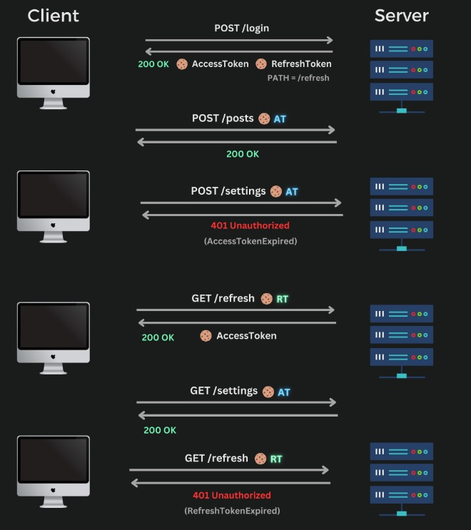

# MERN Authentication Template (JWT)

This is a starter template for a **MERN stack application** using **JSON Web Tokens (JWT)** for authentication.

- **Backend:** TypeScript, Express, MongoDB, Resend (for emails)
- **Frontend:** React, Chakra UI or You can Use Tailwind CSS, React Query
- **JWT Storage:** Secure, HTTP-only cookies
- **Postman Collection:** Included for API testing

---

## ✨ Features

- ✅ Register, Login, Logout
- ✅ Profile Management
- ✅ Account Verification via Email
- ✅ Password Reset via Email
- ✅ Get & Remove Sessions
- ✅ Frontend Forms: Register, Login, Reset Password, etc.
- ✅ Custom React Hooks to Manage Auth State & App Data

---

## 📸 Project Preview

> *(Add your image below - replace the link with your actual image path or URL)*

---

## 🧱 API Architecture

The API is built using a layered structure:

- **Routes:** Handle requests and direct to controllers
- **Controllers:** Validate, call service, send response
- **Services:** Contain business logic, database interaction, or external APIs
- **Models:** Define database schemas and methods

> ℹ️ For simple `GET`/`DELETE` requests, controllers may directly access models.

---

## ⚠️ Error Handling

All errors are handled using a **custom error handler middleware**.  
Controllers are wrapped with the `errorCatch()` utility function to capture errors and pass them to the middleware.

---

## 🧠 API Architecture Visual

> *(Add your image below - replace the link with your actual image path or URL)*

---

## 🔐 Authentication Flow

1. **Login:**
   - Server returns `AccessToken` (15 mins) and `RefreshToken` (30 days)
   - Tokens are stored in **HTTP-only cookies**

2. **Request Flow:**
   - `AccessToken` is sent on each request
   - If expired, client requests `/refresh` with `RefreshToken`
   - If successful, a new `AccessToken` is issued and the original request is retried

3. **Fallback:**
   - If `/refresh` fails, the user is logged out and redirected to login

---

## 🔄 Auth Flow Visual

> *(Add your image below - replace the link with your actual image path or URL)*

---

## 🛠️ Run Locally

### 1. Prerequisites

- Node.js installed
- MongoDB running locally or via [MongoDB Atlas](https://www.mongodb.com/atlas)
- Resend account for sending emails

---

## ⚙️ 3. Backend Setup

### ✅ Prerequisites
Make sure you have the following installed on your system:
- [Node.js](https://nodejs.org/)
- [MongoDB](https://www.mongodb.com/try/download/community) (or use [MongoDB Atlas](https://www.mongodb.com/cloud/atlas))
- [nvm](https://github.com/nvm-sh/nvm) (Node Version Manager)
- [Resend](https://resend.com/) account (for sending verification/reset emails)

---
-📂 Navigate to the Backend Directory
-cd backend

---

-🛠️ Use the Correct Node Version
-bash
-Copy
-Edit
-nvm use
-Make sure .nvmrc is present to specify the required -Node version.

---
📦 Install Backend Dependencies
npm install

---

## 🚀 4. Running the App Locally

### 🔐 Setup `.env` File (Backend)

Before running the server, you need to create a `.env` file in the `backend` directory using the sample file:

cp sample.env .env

---
## 🧪 5. Postman Collection
You can test all API routes using the provided Postman collection.
Inside the backend directory, you'll find a postman.json file.

✅ Import it into Postman and start testing the API endpoints.
---

---
🙌 Built With ❤️ by [Vaishno prakash Tiwari]

---